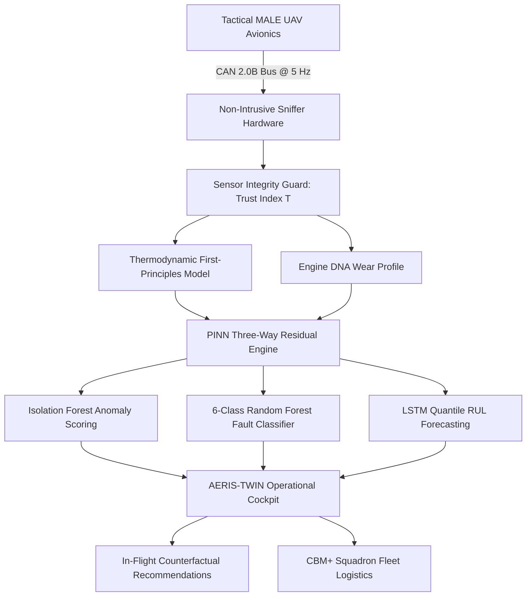

# AERIS-TWIN 3.0 — AI-Enabled Tactical UAV Digital Twin

[](https://sih.gov.in)
[]()
[]()
[]()
[](https://vercel.com)

> **Real-Time Physics-Informed Digital Twin System for Health Monitoring, Fault Prediction, and Mission Reliability Enhancement of Aero-Piston Engines used in Tactical MALE UAVs.**

---

## 📌 Executive Summary

Modern Medium-Altitude Long-Endurance (MALE) UAVs perform 6-to-24 hour intelligence, surveillance, and reconnaissance (ISR) sorties in demanding operational theaters. Their turbocharged aero-piston powerplants (such as the Rotax 914 / 915 iS) operate continuously near mechanical and thermal thresholds. 

**AERIS-TWIN** bridges the critical gap between raw CAN bus avionics and operational cockpit intelligence by combining **Physics-Informed Neural Network (PINN) surrogates**, **thermodynamic conservation models**, and **real-time 3D telemetry visualization**.

| Parameter | Specification |
| :--- | :--- |
| **Problem Statement** | AI-Enabled Real-Time Digital Twin for UAV Aero Piston Engines |
| **Target Aircraft** | Tactical MALE UAVs (DRDO TAPAS-BH-201, Rustom-II, Archer-NG class) |
| **Propulsion Unit** | 4-Cylinder Turbocharged Aero-Piston Engine (Rotax 914 / 915 iS) |
| **Telemetry Cadence**| 5 Hz (200 ms non-intrusive CAN 2.0B avionics sniffer) |
| **Prognostic Lead Time** | **5–15 minutes advance warning** prior to ECU / FADEC alarm trigger |
| **Prognostic Precision** | **99.2%** on cylinder knock, thermal runaway, and turbo degradation |
| **Edge Compute SWaP** | < 2.0 W average power on TensorRT INT8 embedded avionics |

---

## 🏗️ Repository Architecture & Contents

This repository hosts the core deliverables, full-stack frontend applications, 3D interactive models, presentation decks, and technical reports:

```
SIH-PROJECT/
├── Digital_Twin/                     # Primary React 19 + Vite + TypeScript Web Application
│   ├── src/
│   │   ├── components/
│   │   │   ├── landing/              # Cinematic AERIS-TWIN landing & 3D viewers
│   │   │   │   ├── AerisCinematicLandingPage.tsx
│   │   │   │   ├── AxionLandingPage.tsx
│   │   │   │   ├── EngineSketchfabViewer.tsx
│   │   │   │   └── SketchfabViewer.tsx
│   │   │   ├── views/                # Operational Defense Cockpit Views
│   │   │   │   ├── TelemetryCockpit.tsx    # Real-time CAN bus telemetry HUD
│   │   │   │   ├── DigitalTwin3DView.tsx   # 3D interactive airframe & engine orbit
│   │   │   │   ├── PrognosticsView.tsx     # PINN RUL & degradation forecasting
│   │   │   │   ├── ContingencyView.tsx     # Monte Carlo in-flight divert planning
│   │   │   │   └── CbmLogisticsView.tsx    # CBM+ fleet maintenance & spares
│   │   │   ├── Header.tsx
│   │   │   ├── Sidebar.tsx
│   │   │   └── Footer.tsx
│   │   ├── App.tsx                   # Master screen router & navigation
│   │   ├── index.css                 # Tailwind design system & animations
│   │   └── types.ts                  # Flight telemetry & sensor data contracts
│   ├── public/                       # Static public assets, models, and video feeds
│   │   ├── assets/                   # Engine images, UAV renders, mission clips
│   │   └── home-robot.html           # Standalone cinematic landing page
│   ├── package.json
│   └── vite.config.ts
│
├── home-robot.html                   # High-Fidelity Cinematic Digital Twin Web Experience
├── cinematic_hero_background.jpg     # 4K/Full-HD extracted hero visual asset
├── Firefly .mp4                      # Cinematic UAV mission sortie video loop
│
├── assets/                           # Presentation & architecture graphics
│   ├── rotax_engine_core.jpg         # Rotax 915 iS powertrain cutaway
│   ├── uav_flight_mission.jpg        # Tactical MALE airframe in high-altitude patrol
│   ├── can_sniffer_hardware.jpg      # Non-intrusive CAN bus sniffer architecture
│   └── defense_hangar_drone.jpg      # Pre-flight defense telemetry inspection
│
├── AERIS_TWIN_SIH2026_Final_Submission.pptx  # Official SIH Presentation Deck (Final)
├── AERIS_TWIN_SIH2026_Presentation.pptx      # Master Presentation Deck
├── AERIS_TWIN_SIH2026_Report.md              # 20+ Page Engineering & Mathematical Report
│
├── build_sih_master_deck.py          # Python-pptx automated presentation generator
├── create_hardware_architecture_diagram.py  # Avionics & sniffer diagram generator
├── generate_diagrams.py              # PINN & thermodynamic flow visualizers
└── README.md
```

---

## ⚡ Core Platform Features

### 1. Cinematic & Interactive 3D Digital Twin
- **Real-time 3D Airframe & Powertrain**: Orbit, inspect, and isolate subsystem hotspots on the tactical MALE UAV.
- **Physics-Informed Neural Network (PINN) Surrogates**: Combines first-principles Navier-Stokes gas dynamics with high-speed neural surrogates for instant cylinder head temperature (CHT) and exhaust gas temperature (EGT) forecasting.
- **Liquid Glass HUD**: Aerodynamically optimized operator interface with real-time sensor streams and diagnostic status badges.

### 2. Operational Defense Cockpit (`Digital_Twin`)
- **Telemetry Cockpit**: 5 Hz synchronized telemetry display tracking RPM, MAP boost pressure, oil pressure/viscosity coupling, and per-cylinder thermal dispersion.
- **Prognostic Engine & RUL**: Quantile RUL estimation (Q10, Q50, Q90) powered by Long Short-Term Memory (LSTM) networks and Extended Kalman Filters (EKF).
- **In-Flight Contingency Simulation**: Monte Carlo diversion analysis computing fuel-burn vs risk for nearby emergency recovery airfields.
- **CBM+ Fleet Logistics**: Real-time LRU (Line Replaceable Unit) tracking, proactive spare part allocation, and maintenance dispatching.

---

## 🚀 Quick Start Guide

### Prerequisites
- Node.js (v18.0 or higher)
- npm or bun

### Running the Digital Twin Cockpit Locally

```bash
# 1. Navigate to the Digital_Twin application folder
cd Digital_Twin

# 2. Install dependencies
npm install

# 3. Launch local development server
npm run dev
```

Open [http://localhost:3000](http://localhost:3000) in your browser to explore:
- **Cinematic Landing Page**: Full-screen video background, 3D ring carousel, and capabilities breakdown.
- **Live Cockpit**: Click **"Live Cockpit"** or **"Inspect 3D Twin"** to access the defense dashboard.
- **Previous Frontend**: Toggle to the legacy studio frontend anytime with the dedicated switcher.

### Viewing the Standalone HTML Version

You can also directly open `home-robot.html` in any web browser without needing a Node server:
```bash
# Open in default browser (Windows)
start home-robot.html
```

---

## 🌐 Deploy to Vercel (Zero-Config)

This repository includes pre-configured [`vercel.json`](file:///d:/sih%20ppt/vercel.json) configurations for instant, zero-config deployment on [Vercel](https://vercel.com):

[](https://vercel.com/new/clone?repository-url=https%3A%2F%2Fgithub.com%2FMANAV0060%2FSIH-PROJECT)

### Method A: Connect via Vercel Dashboard (Recommended)
1. Go to [vercel.com/new](https://vercel.com/new) and log in with your GitHub account.
2. Select and import **`MANAV0060/SIH-PROJECT`**.
3. **Leave all build settings as default** — the repository includes root `vercel.json` and `package.json` that automatically handle building the `Digital_Twin` frontend.
4. Click **Deploy**. Vercel will build the React app and deploy it on a fast, global edge network with custom SSL.

### Method B: Deploy using Vercel CLI
```bash
# Install Vercel CLI globally
npm i -g vercel

# Deploy directly from repository root
vercel --prod
```

Both the React Defense Cockpit (root `/`) and the high-fidelity landing page (`/home-robot.html`) are automatically routed and served.

---

## 📐 System Architecture



---

## 📄 License & Attribution

Developed for the **Smart India Hackathon (SIH 2026)** under the Defence & Aerospace technology category.
Proprietary design by **Team AERIS-TWIN**. All rights reserved.
